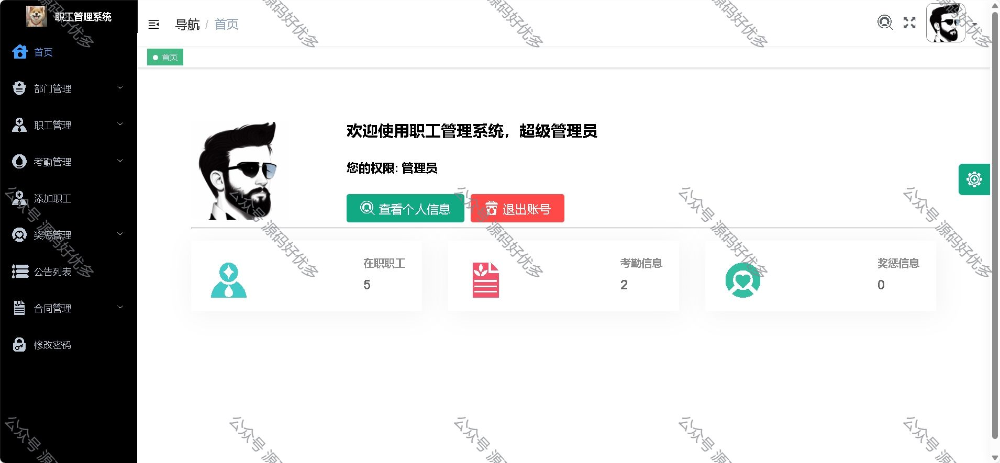
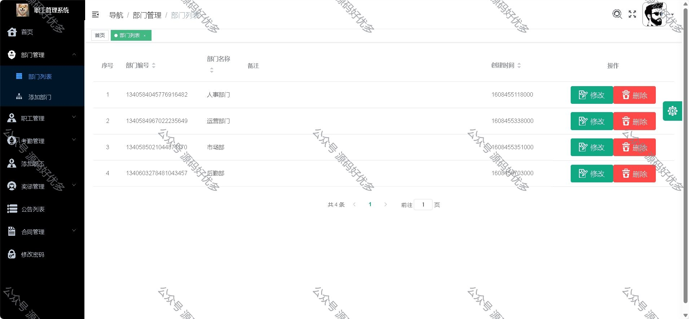
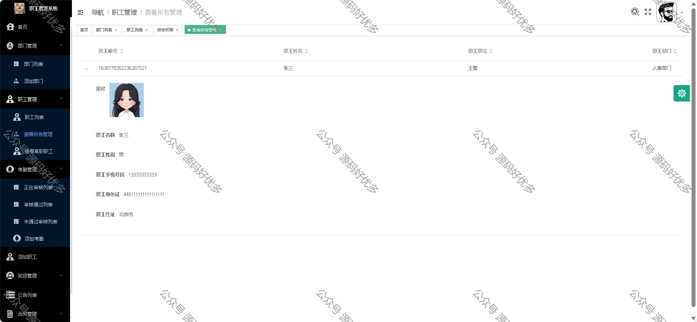
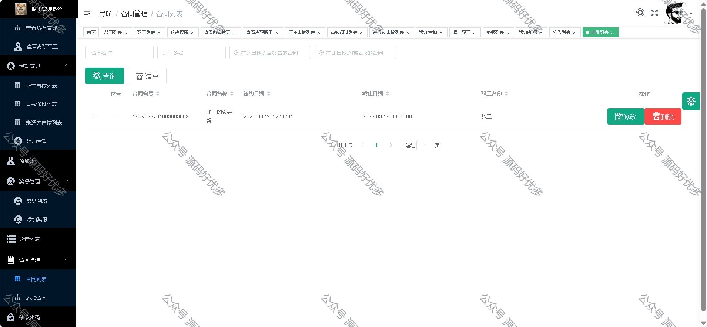
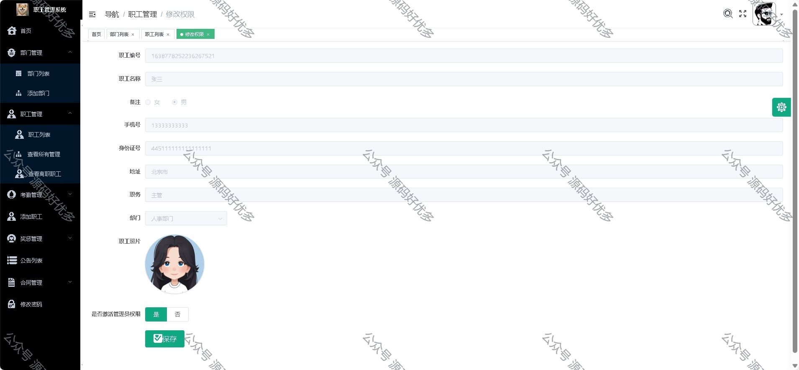
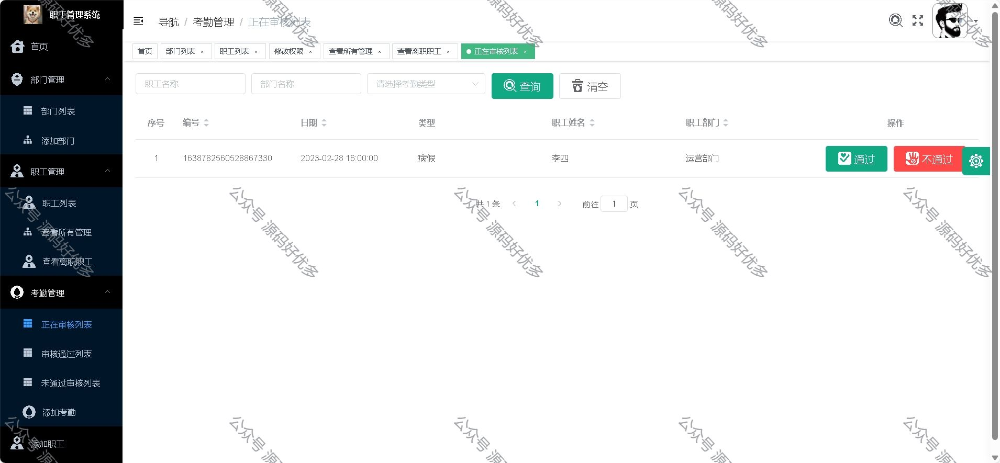
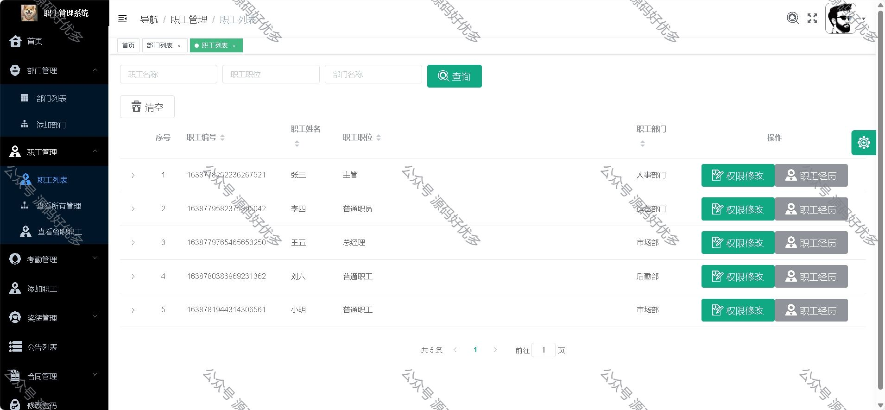

### 一、作品包含

源码+数据库+全套环境和工具资源+部署教程

### 二、项目技术

前端技术：Html、Css、Js、Vue、Element-ui

数据库：MySQL

后端技术：Java、Spring Boot、MyBatis

### 三、运行环境

开发工具：IDEA/eclipse

数据库：MySQL8.0

数据库管理工具：Navicat10以上版本

环境配置软件： JDK1.8+Maven3.6.3

前端Nodejs：16

### 四、项目介绍

项目编号：springbootA018

员工管理对于任何公司和组织都是至关重要的。它涉及到对员工信息的管理、员工考勤、工资管理等方
面。传统的手工管理方式已经无法满足现代组织的需求，因此开发一个高效、灵活、可扩展的员工管理
系统变得非常必要。
设计了三种角色，分别是管理员、人事经理、职工，每种角色拥有不同的菜单权限
系统实现了部门管理、职工管理、考勤管理、奖惩管理、公告管理，以及合同管理等功能模块

### 五、运行截图

